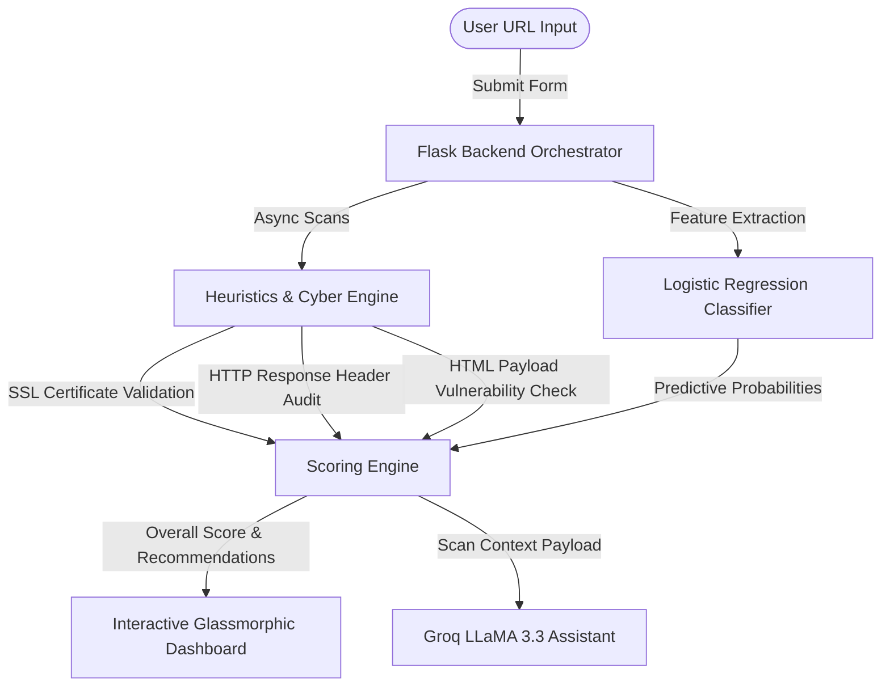

# 🛡️ SecureU — Cybersecurity Scanner & AI Threat Assistant

[](https://www.python.org/)
[](https://flask.palletsprojects.com/)
[](https://scikit-learn.org/)
[](./LICENSE)
[](https://vercel.com/)

SecureU is a production-ready, hybrid web vulnerability scanner and intelligent threat defense tool. Designed for modern web auditing, it combines **active cybersecurity heuristics** with a **machine learning classifier (Logistic Regression)** to deliver multi-layered threat assessments of target URLs in real-time. 

Additionally, it features an interactive **AI Security Chatbot** powered by Groq (LLaMA 3.3) to provide contextual, actionable explanations and mitigation plans based on the live scan results.

---

## 🚀 Key Features

### 🔐 Active Cybersecurity Auditing
1. **SSL / TLS Certificate Checker**: Conducts deep socket handshakes to validate HTTPS validity, issuer status, and certificate expiration issues.
2. **Security Headers Compliance**: Audits responses for crucial modern headers (`Content-Security-Policy`, `X-Frame-Options`, `Strict-Transport-Security`, `X-XSS-Protection`, `X-Content-Type-Options`, `Referrer-Policy`).
3. **Passive Vulnerability Scan**: Crawls response content to detect potential Cross-Site Scripting (XSS) and SQL Injection (SQLi) vectors.
4. **Passive URL Heuristics**: Evaluates URL strings for brand keyword typosquatting, suspicious TLDs, excessive subdomains, IP-based masking, and obfuscated encoding.
5. **Infrastructure Availability**: Tracks latency, request timeouts, and HTTP status code reliability.

### 🤖 Intelligent Machine Learning & AI
1. **Intent Classifier (Logistic Regression)**: Predicts the likelihood of a URL being malicious based on feature vectors extracted from URL characteristics (length, HTTPS status, special chars, IP usage).
2. **AI Chatbot (LLaMA 3.3 via Groq)**: A floating chatbot assistant that ingests the active scan context, answers questions, and suggests code snippets to fix security flaws.

---

## 🛠️ System Architecture



---

## 💻 Tech Stack

- **Backend**: Python 3.11, Flask
- **Frontend**: Bootstrap 5, Glassmorphic Vanilla CSS, FontAwesome 6, marked.js
- **Machine Learning**: scikit-learn, numpy, pandas (model training only)
- **AI Integration**: Groq API (llama-3.3-70b-versatile model)
- **Deployment**: Vercel Serverless Functions (`@vercel/python`)

---

## ⚙️ Project Reorganization

The project has been cleaned up and optimized for production deployment:
- **Clean Root Structure**: Legacy nested folders (`task/task/`) have been removed. All core application files reside at the root.
- **Production Optimization**: `pandas` has been removed from the runtime dependencies (`requirements.txt`) to optimize Vercel's Serverless Function bundle size and boost cold-start execution speeds.
- **Environment Separation**: Local secrets have been removed, replaced with `.env` configuration loading, and templated in `.env.example`.
- **Favicon & SEO**: Included search engine optimization headers, Open Graph metadata, and a modern SVG-based favicon.

---

## 🚀 Installation & Local Development

### 1. Clone the Repository
```bash
git clone <repository-url>
cd SecureU
```

### 2. Set Up Virtual Environment
```bash
python -m venv venv
# On Windows:
venv\Scripts\activate
# On macOS/Linux:
source venv/bin/activate
```

### 3. Install Dependencies
To install standard application dependencies:
```bash
pip install -r requirements.txt
```
*Note: If you plan to retrain the ML model using `train_model.py`, install the developer requirements instead:*
```bash
pip install -r requirements-dev.txt
```

### 4. Configure Environment Variables
Copy `.env.example` to `.env` and fill in your keys:
```bash
cp .env.example .env
```
Open `.env` and configure:
```env
FLASK_SECRET_KEY=your-random-secret-key-here
GROQ_API_KEY=your-groq-api-key-here
```

### 5. Train the Machine Learning Model
The model binaries are pre-packaged. However, to retrain them on the provided dataset:
```bash
python train_model.py
```

### 6. Run the Application Locally
```bash
python app.py
```
Open your browser and navigate to `http://127.0.0.1:5000/`.

---

## ☁️ Vercel Deployment

SecureU is fully configured for deployment on Vercel using `vercel.json` and serverless Python functions.

### Steps to Deploy:
1. Push your repository to GitHub.
2. Sign in to your [Vercel Dashboard](https://vercel.com) and click **Add New Project**.
3. Import the `SecureU` repository.
4. Add the following **Environment Variables** in the Vercel project configuration:
   - `FLASK_SECRET_KEY` (a random secure key)
   - `GROQ_API_KEY` (your Groq API key)
5. Click **Deploy**. Vercel will automatically discover the `vercel.json` file, install dependencies from `requirements.txt`, and build the serverless functions.

---

## 📄 License
This project is licensed under the MIT License - see the [LICENSE](./LICENSE) file for details.
